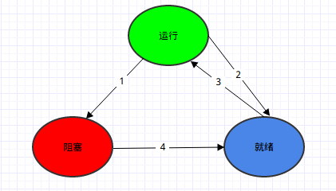

#线程与进程

##进程
*	什么是进程: 

>	一个进程就是一个正在执行程序的实例，包括程序计数器，寄存器等上下文.

*	进程和程序的区别: 

>	程序是一组指令的集合，它是静态的实体，没有执行的含义。而进程是一个动态的实体，有自己的生命周期，它是一个活动，有程序，输入输出和状态等，比如使用的寄存器，打开的文件描述符等等．

*	创建进程：

>	`Unix`下只有一个系统调用`fork`可以用来创建新进程，创建后的进程可以说是父进程的一个完全拷贝，通常子进程需要执行类似`execve`的命令以修改其存储映像并运行一个新的程序.

*	进程的终止：

>	进程的终止主要有正常的退出，比如程序执行完了或者执行了exit等；还有出现严重错误而退出，比如段错误等；还有就是被其他进程杀死，在`Unix`系统中进程可以通过系统调用`kill`来杀死其他进程.

*	进程的层次结构：

>	`Unix`中`fork`一个新进程就会出现父子进程关系，这就导致了出现了进程的层次关系，`Unix`中所有进程都是属于基于`init`这个进程为根的一棵树上．父进程和子女进程通常组成一个进程组.

*	进程的状态：

	*	运行:     正在占用cpu
	*	阻塞:	除非某种外部时间发生，否则不能运行．比如等待终端输入字符
	*	就绪:	可以立马运行，但是由于其他进程在占用cpu不得不在等待.

	这三种状态的相互转化关系如下:

*	进程的实现
	*	进程表: 

	>	操作系统维护一张表格，记录每个进程的状态信息，包含程序寄存器，栈堆指针等

##线程
