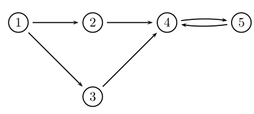
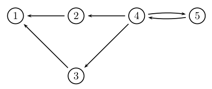
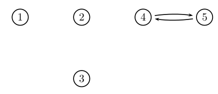

#强连通分量 :smirk:

##定义
	对于向图中G=(V,E),如果任意节点都时相互可达的,则该有向图是强连通的.
	G的强连通分量是"相互可达"的顶点的等价类,G的强连通分量是其的一个极大连通子图.

##算法

	求有向图G强连通分量，主要对图G以及图G的转置图分别进行DFS.

	1.从某个顶点v开始进行DFS,记录访问到的顶点集合, 根据DFS的特点我们可以知道对于F中每个顶点，v都可以到达. 
	2.从顶点v开始对进行DFS,记录访问到的顶点集合.
	3.计算F与B的交集C, 假设,
		那么对于C中任意顶点对p,q: 首先q属于F，则G中必有v -> q的路径，然后p属于B,
		则在中必有v -> p的路径，
		那么在G中必有p -> v的路径，所以G中必有p -> v -> q的路径，同理可得必有q -> v -> p的路径，即p,q可以互达.

	所以可以确定集合C是一个连通分量，那么如果存在某个节点t,不属于C,但是可以与C合成一个连通分量，那么t必然与v互达，那么ｔ必然属于F与B集合，则t必然属于C集合，所以矛盾，所以C是极大连通分量.

举例：
---

图G



---

图



---

图G的强连通分量



---

代码:
---
```C++
//--------------------Strong Connect Component--------------------------
//Time Complex O(V^2)

void SCCDfs(vector<vector<Node> > &data, vector<bool> &visited, vector<bool> &trace, int v){
	trace[v] = true;
	for(int i = 0; i < data[v].size(); i++){
		if(!trace[data[v][i].index] && !visited[data[v][i].index]){
			SCCDfs(data, visited, trace, data[v][i].index);
		}
	}
}

vector<vector<int> > getStrongConnectComponent(vector<vector<Node> > &data){
	int vecnum = data.size();
	vector<vector<int> > ret;
	vector<bool> visited(vecnum, false);
	vector<vector<Node> > reverse(vecnum, vector<Node>());

	//reverse the data
	for(int i = 0; i < data.size(); i++){
		for(int j = 0; j < data[i].size(); j++){
			reverse[data[i][j].index].push_back(Node(i, data[i][j].weight));
		}
	}

	for(int i = 0; i < vecnum; i++){
		if(!visited[i]){
			vector<bool> forward(vecnum, false), back(vecnum, false);
			vector<int> cur;
			SCCDfs(data, visited, forward, i);
			SCCDfs(reverse,visited, back, i);
			for(int j = 0; j < vecnum; j++){
				if(forward[j] && back[j]){
					cur.push_back(j);
					visited[j] = true;
				}
			}
			ret.push_back(cur);
		}
	}
	return ret;
}

//--------------------Strong Connect Component--------------------------
```
时间复杂度O(V^2)
