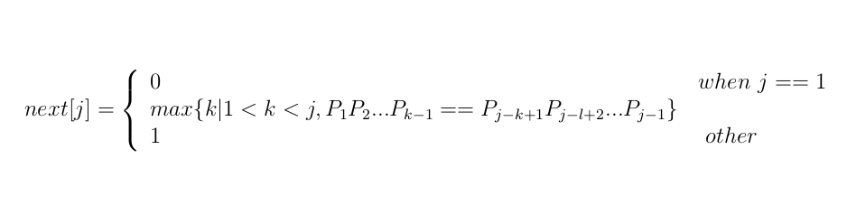

###模式匹配线性时间算法----KMP
####问题
    给定模式串P，主串S，确定主串S中是否包含模式串P
####KMP算法分析
给定

主串 ， 模式串

#####1. 匹配过程分析 
当匹配至时，为使主串不回退，假设从模式串P的第k个位置开始重新匹配，则必有


可以推出：


假设存在数组， 表示当模式串第j个字符不匹配时，应该从模式串的第k个字符开始重新匹配。根据上面的公式，则可由下式计算



当求出next数组后，当每次不匹配时，直接从next中取出需要重新和主串当前位置匹配的模式串的索引，即可实现主串不回退匹配

#####2. 求next数组
我们用dp的思想来分析这个问题：

对于, 有 

(1) 如果，则有


(2)如果

已知， 假设


那么下一个最长的和匹配的模式子串必然为, 很简单, 通过(2)中前两个公式即可推出，那么

(2.1)如果则能推出

(2.2)如果重复(2)过程

(2.3)如果则

####C代码
```
void gen_next(const char *p) {
    next[0] = -1;
    int i = 0;
    int j = -1;
    int lp = strlen(p);
    while(i < lp)
        if(j == -1 || p[i] == p[j]) i++, j++, next[i] = j;
        else j = next[j];
}
int kmp(const char *s, const char *p) {
    gen_next(p);
    int ls = strlen(s);
    int lp = strlen(p);
    int i = -1;
    int j = -1;
    while(i < ls && j < lp)
        if(j == -1 || s[i] == p[j]) i++, j++;
        else j = next[j];
    if(j == lp) return i - lp;
    return -1;
}
```
时间复杂度

|过程|时间复杂度|
|:----:|:----|
|next|O(m)|
|匹配|O(n)|
|KMP|O(m+n)|
